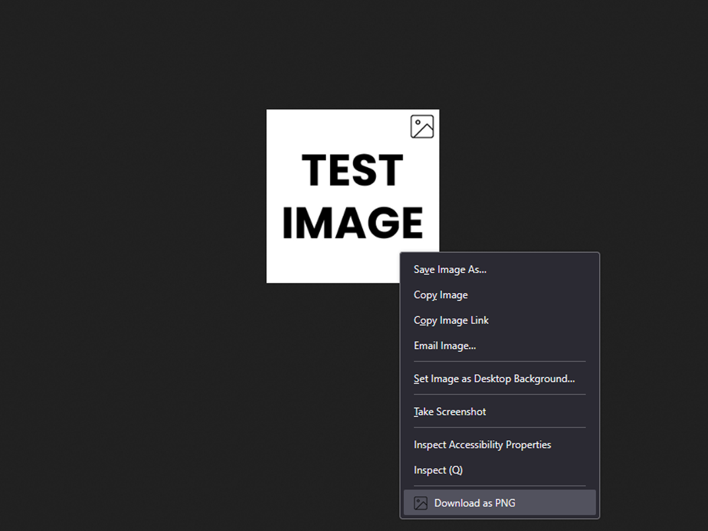

# Image to PNG Converter

A simple Firefox extension that allows users to download any image (JPG, WebP, PNG, GIF, etc.) as a PNG file with a right-click.

## Features

- Adds a "Download as PNG" option to the right-click context menu when clicking on images
- Works with any image format (JPG, WebP, PNG, GIF, etc.)
- Automatically converts images to PNG format
- Preserves original image dimensions and quality
- Prompts user to choose where to save the converted image

## Installation

### From Firefox Add-ons Store

You can install this extension directly from the official Firefox Add-ons Store:

➡️ [Download from Firefox Add-ons](https://addons.mozilla.org/en-US/firefox/addon/image-to-png-converter/)

### From Source

1. Clone this repository or download it as a ZIP
2. Open Firefox and navigate to `about:debugging`
3. Click on "This Firefox"
4. Click "Load Temporary Add-on"
5. Navigate to the extension folder and select the `manifest.json` file

### Directory Structure

```
image-to-png-converter/
├── icons/
│   ├── icon-48.png
│   └── icon-96.png
├── images/
│   └── preview.png
├── background.js
├── LICENSE
├── manifest.json
└── README.md
```

## Usage

1. Right-click on any image on a webpage
2. Select "Download as PNG" from the context menu
3. Choose where to save the converted PNG file

## Preview



## License

This project is licensed under the GNU General Public License v3.0 - see the [LICENSE](LICENSE) file for details.

## Author

Created by [TheSytx](https://github.com/TheSytx)